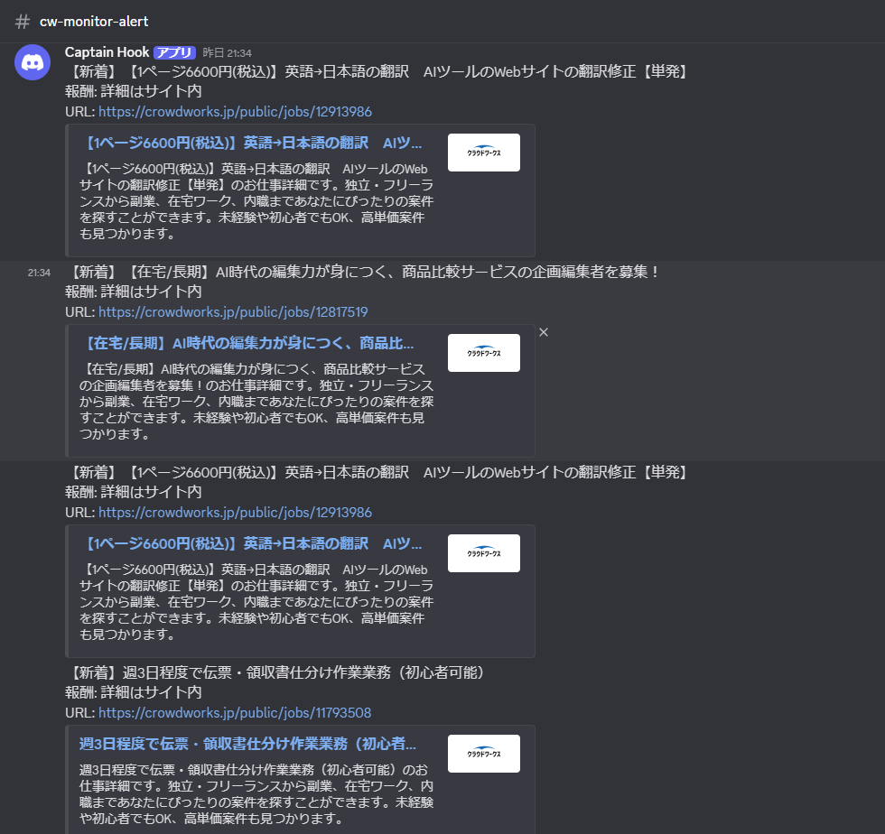
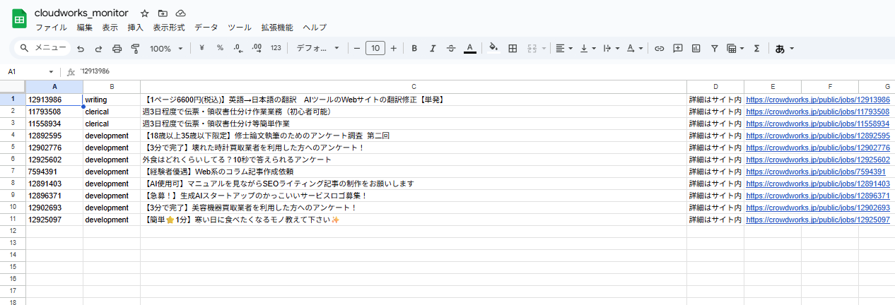

# CrowdWorks Job Hunter (AI & General Tasks)

クラウドワークスの特定カテゴリを自動巡回し、条件に合致する「案件」を抽出してDiscord通知＆Googleスプレッドシートへ保存する自動化ツールです。

## 🌟 開発の背景
クラウドワークスでの案件探しにおいて、以下の課題を解決するために開発しました。
* **タイムロスの削減**: 毎日手動で新着を確認する手間を省き、即座にキャッチしたい。
* **情報の集約**: 気になる案件をスプレッドシートに自動蓄積し、後で比較検討しやすくしたい。

## 🛠 使用技術
* **Language**: Python 3.13
* **Library**: 
    * `Playwright` (スクレイピング)
    * `gspread` (Google Sheets API)
    * `Discord Webhook` (通知)
    
### 開発環境 (Development Environment)
* **Editor**: VS Code
* **OS**: Windows 11 (または macOS など)
* **Package Manager**: pip

### 実行環境 (Runtime Environment)
* **Language**: Python 3.13
* **Libraries**: Playwright, gspread, Webhook

## 🤖 AI活用の取り組み
本プロジェクトでは、開発効率の向上とコード品質の最適化のため、生成AI（Gemini等）を活用しました。

* **設計・ロジックの壁打ち**: 効率的なフォルダ構成や、スクレイピングの判定ロジックの相談。
* **デバッグ・リファクタリング**: エラー解消と、読みやすく保守性の高いコードへの修正。
* **ドキュメント作成**: 技術スタックの整理。

## 🚀 主な機能
1.  **マルチカテゴリ巡回**: 複数カテゴリを一度にスキャン。
2.  **高度なフィルタリング**: AI関連やライティング、タスク案件の優先抽出やNGワード除外。
3.  **重複ガード**: 同じ案件を二度通知しない設計。
4.  **リアルタイム通知**: 条件合致時にDiscordへ即座に送信。



5.  **スプレッドシート保存**: 案件情報を自動で蓄積します。




## 📂 フォルダ構成
```text
├── src/
│   ├── domain/            # データ構造
│   ├── infrastructure/    # 外部連携（スクレイパー、スプレッドシート、Discord）
│   └── usecase/           # 判定ロジック
├── main.py                # エントリーポイント
└── README.md


